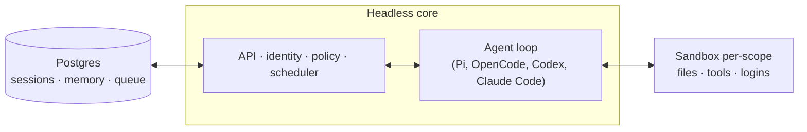

# Agent Inovasi

Coding & working agent untuk tim Indonesia — di web dan (opsional) di Slack.

Agent yang **benar-benar mengerjakan**: memperbaiki bug dan membuka PR, menjawab dari
dokumen internal, dan menjalankan pekerjaan rutin — bukan sekadar chatbot.


## Apa itu Agent Inovasi?

Agent Inovasi adalah agent yang bekerja untuk **tim**. Setiap orang dan setiap ruang punya
workspace terisolasi sendiri — memory, files, keychain, permissions, crons, web apps, dan
sandbox durable — tapi tetap bisa berkolaborasi di channel, group, dan project. **Setiap
langkah teraudit.**

Dibangun terbuka: pilih harness dan model sendiri. Pi, OpenCode, Codex, dan Claude Code
menggerakkan core yang sama, jadi tidak terkunci ke satu vendor — dan bisa jalan di atas
**open model** seperti DeepSeek.

## Yang bisa dikerjakan

- **Koding beneran** — kerja di repository yang ada: jalankan test, buka PR, monitor CI, cek log.
- **Jawab dari dokumen internal** — notes, email, dokumen, database, dan web sekaligus, dengan sumber.
- **Otomasi rutin** — cron & watch yang jalan saat tidak ditungguin (triage inbox, laporan terjadwal).
- **Bangun & terbitkan aplikasi internal** ke orang yang tepat.
- **Ingat & belajar** — memory berskop, plus skills (prosedur yang bisa dipakai ulang dan dibagikan).

## Fitur inti

- **Scope personal & bersama.** Tiap orang mempersonalisasi agent-nya, tetap bisa kolaborasi di project.
- **Web (& Slack opsional).** Identitas dan konfigurasi yang sama lintas surface.
- **Kontrol admin.** Atur security posture, serta harness & model yang diizinkan.
- **Web apps.** Buat aplikasi internal lalu terbitkan ke pengguna yang tepat.
- **Shared skills.** Skills dimiliki scope, dibagikan lewat grant, bisa dipromosikan ke seluruh org.
- **Background work.** Crons & watches berjalan saat tidak ada yang menunggui.

## Arsitektur



Setiap turn melewati satu core terpusat yang bisa memakai berbagai model dan harness.
Postgres menyimpan data pengguna, riwayat sesi, dan state durable lain. Agent punya tool
surface yang kecil dan tetap; salah satunya `execute` — menjalankan perintah di **sandbox
Linux terisolasi** milik scope (komputer durable-nya, tempat tools yang di-install tetap
terpasang). Web UI, admin, dan portal adalah plugin opsional di atas HTTP API core; Slack
adalah plugin in-process opsional.

Core berjalan langsung di Node (TypeScript) dengan Fastify. Web UI dibangun dengan Vite +
Lit. Sandbox agent sudah dilengkapi dev tools (git, Node, Python, dll.), jadi agent bisa
langsung clone → edit → test → commit.

## Keamanan

Agent bertindak **sebagai** orang yang diwakilinya — dengan kredensial dan izin mereka —
dan semuanya teraudit. Org memilih satu security posture yang hanya bisa diperketat oleh
scope yang lebih sempit:

- **Strict** — tiap tool call menunggu persetujuan manusia.
- **Auto** (default) — classifier menyaring data eksternal berlabel provenance sebelum sampai ke model.
- **Dangerous** — tanpa penyaringan, tanpa jeda.

Command policy (aturan approval & larangan keras seperti `rm -rf` atau SQL destruktif)
berlaku di semua posture. Detail model ancaman, asumsi operator, dan batasan yang
diketahui ada di [`SECURITY.md`](./SECURITY.md).

## Jalankan di mesin sendiri (satu perintah)

Untuk mencoba Agent Inovasi secara lokal — chat UI, admin, model (DeepSeek), Postgres, dan
sandbox agent langsung ter-wiring — lihat [`QUICKSTART.md`](./QUICKSTART.md):

```bash
npm install
npm run quickstart
```

Butuh Node ≥ 24.15, Docker, dan sebuah DeepSeek API key.

## Deploy untuk org

CLI menyiapkan deployment ke **Docker**, **Fly.io**, atau **AWS**:

```bash
node cli/bin/qm.ts init . --org <slug> --target <docker|fly|aws>
```

Setiap deployment berjalan di akun cloud milik operator. Untuk pakai DeepSeek, set
`MODEL_PROVIDER=deepseek` + `DEEPSEEK_API_KEY`. Detail lengkap ada di
[`deployment.md`](./deployment.md) dan [`cli/README.md`](./cli/README.md).

## Cek kesiapan sebagai coding agent

```bash
npm run coding-check
```

Memvalidasi bahwa harness dapat melayani model yang dipilih, sandbox punya dev tools
(git/node/python), dan tool `execute` ter-wiring — tanpa perlu API key.

## Lisensi

Kecuali dinyatakan lain, Agent Inovasi tersedia di bawah [MIT License](./LICENSE).
