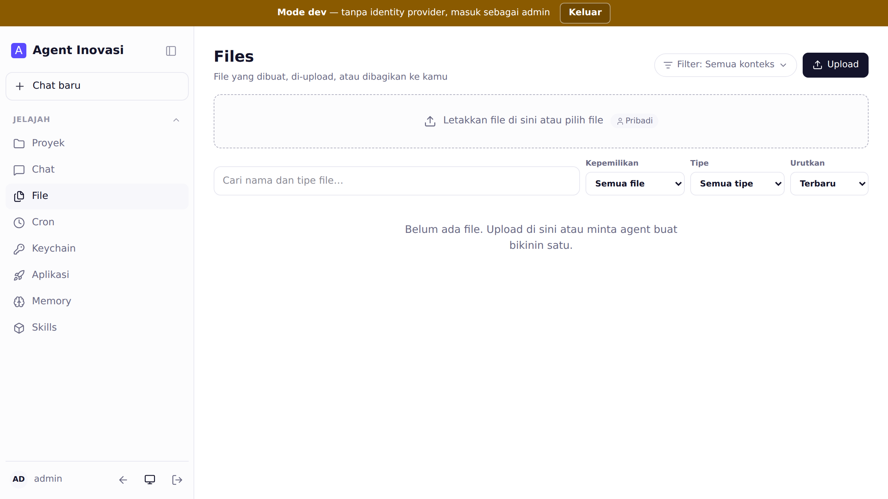
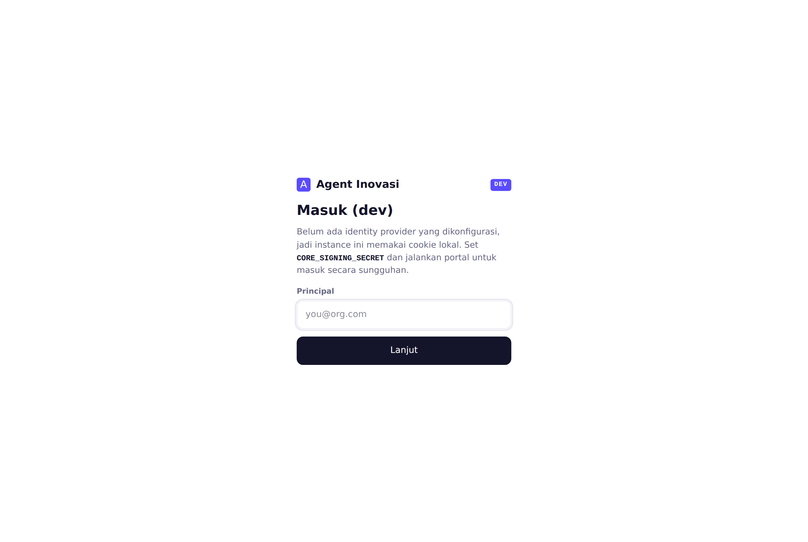
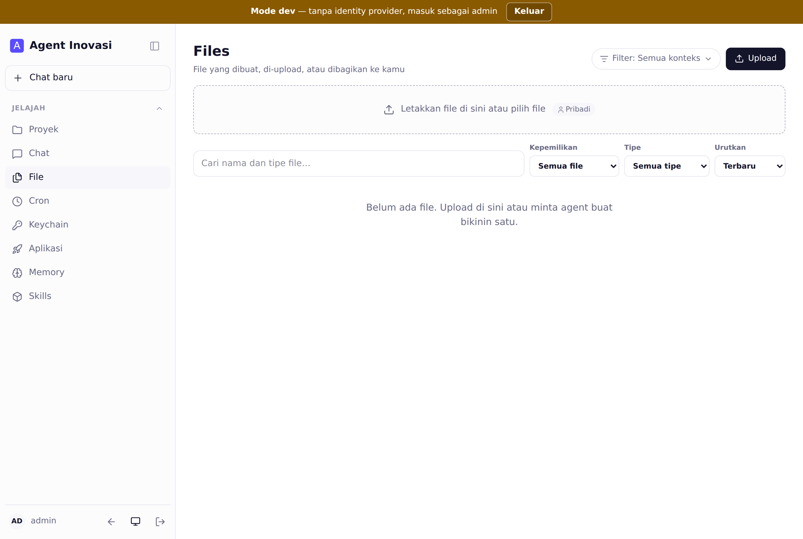
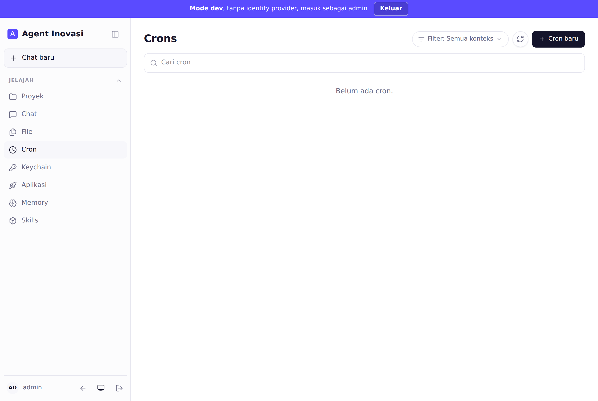
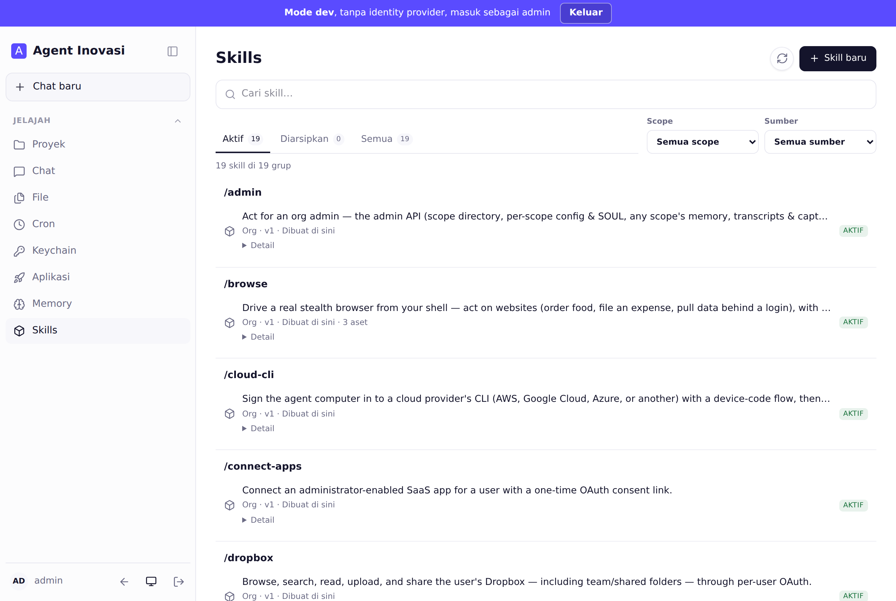
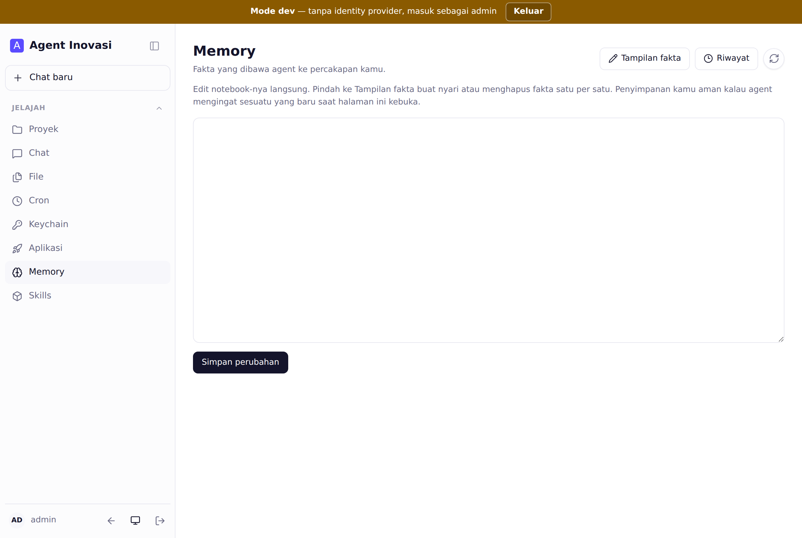
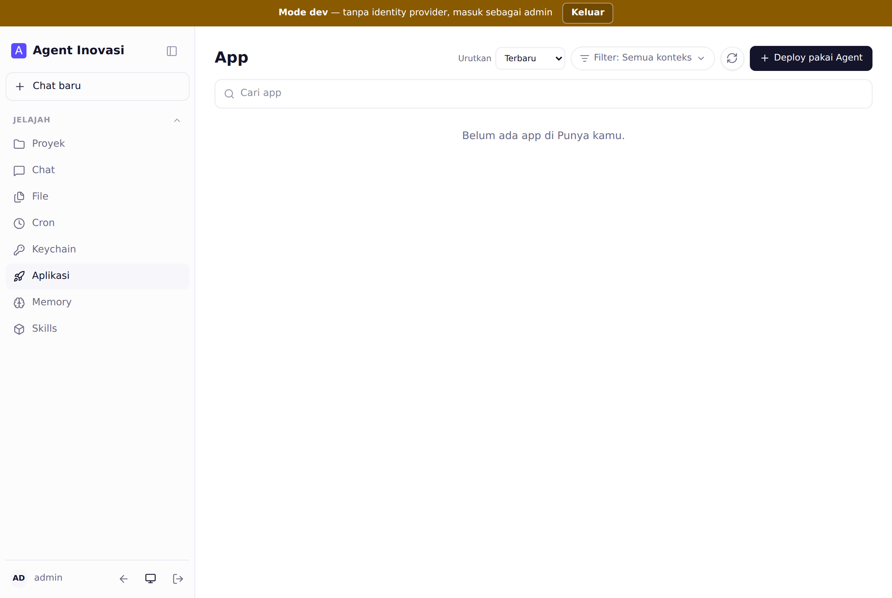
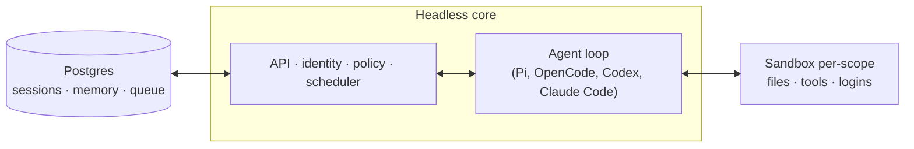

# Agent Inovasi

Coding & working agent untuk tim Indonesia — di web dan (opsional) di Slack.

Agent Inovasi bukan sekadar chatbot. Ia benar-benar mengerjakan tugas: memperbaiki
bug dan membuka PR, menjawab dari dokumen internal, serta menjalankan pekerjaan rutin
secara otomatis. Kamu cukup memberi instruksi lewat chat, sisanya dikerjakan agent.



## Daftar isi

- [Apa itu Agent Inovasi](#apa-itu-agent-inovasi)
- [Panduan cepat: menjalankan di mesin sendiri](#panduan-cepat-menjalankan-di-mesin-sendiri)
- [Mengenal tampilan](#mengenal-tampilan)
- [Cara pakai sehari-hari](#cara-pakai-sehari-hari)
- [Deploy untuk organisasi](#deploy-untuk-organisasi)
- [Cek kesiapan sebagai coding agent](#cek-kesiapan-sebagai-coding-agent)
- [Keamanan](#keamanan)
- [Arsitektur](#arsitektur)
- [Lisensi](#lisensi)

## Apa itu Agent Inovasi

Agent Inovasi adalah agent yang bekerja untuk **tim**. Setiap orang dan setiap ruang
punya workspace terisolasi sendiri — memory, file, keychain, permission, cron, web app,
dan sandbox durable — tetapi tetap bisa berkolaborasi di channel, group, dan project.
**Setiap langkah teraudit.**

Dibangun terbuka: kamu memilih sendiri harness dan model yang dipakai. Pi, OpenCode,
Codex, dan Claude Code menggerakkan core yang sama, jadi tidak terkunci ke satu vendor —
dan bisa berjalan di atas **open model** seperti DeepSeek.

Yang bisa dikerjakan:

- **Mengerjakan kode** — bekerja langsung di repository yang ada: menjalankan test, membuka PR, memonitor CI, membaca log.
- **Menjawab dari dokumen internal** — notes, email, dokumen, database, dan web sekaligus, lengkap dengan sumber.
- **Otomasi rutin** — cron & watch yang berjalan tanpa perlu ditunggu (triage inbox, laporan terjadwal).
- **Membangun & menerbitkan aplikasi internal** ke orang yang tepat.
- **Mengingat & belajar** — memory berskop, ditambah skills (prosedur yang bisa dipakai ulang dan dibagikan).

## Panduan cepat: menjalankan di mesin sendiri

Cara tercepat mencoba Agent Inovasi secara lokal — chat UI, admin, model (DeepSeek),
Postgres, dan sandbox agent langsung terhubung.

**Yang perlu disiapkan:** Node ≥ 24.15, Docker, dan sebuah DeepSeek API key.

**Langkahnya:**

```bash
npm install
npm run quickstart
```

Perintah ini akan memeriksa kebutuhan sistem, menanyakan DeepSeek API key, menyiapkan
Postgres dan sandbox, lalu menjalankan core beserta web UI. Setelah selesai, buka alamat
yang ditampilkan di terminal (default `http://localhost:8096`).

Detail lengkap dan opsi lain ada di [`QUICKSTART.md`](./QUICKSTART.md).

### Masuk pertama kali

Saat identity provider belum dikonfigurasi, instance memakai cookie lokal (mode dev).
Masukkan alamat email kamu sebagai principal, lalu klik **Lanjut**.



## Mengenal tampilan

Menu utama ada di sidebar kiri (**Jelajah**). Berikut fungsi tiap bagian.

### Chat

Tempat kamu memberi instruksi — persis seperti tampilan di bagian atas README. Ketik
permintaan di kolom **Tanya apa saja**, lalu agent mengerjakannya. Model dan harness bisa
dipilih di kanan bawah kolom chat. Setiap percakapan tersimpan di daftar session, dan bisa
dibagikan ke project agar tim ikut melihat.

### File

Semua file yang kamu upload, yang dibuat agent, atau yang dibagikan ke kamu ada di sini.
Kamu bisa menyaring berdasarkan kepemilikan dan tipe, atau meminta agent membuat file baru.



### Cron

Untuk pekerjaan yang berjalan otomatis dan terjadwal — misalnya triage inbox tiap pagi
atau laporan mingguan. Cron tetap berjalan meski tidak ada yang menunggu.



### Skills

Skill adalah prosedur yang bisa dipakai ulang dan dibagikan. Skill dimiliki oleh scope,
dibagikan lewat grant, dan bisa dipromosikan ke seluruh organisasi. Instance ini sudah
membawa sejumlah skill bawaan (misalnya `/browse`, `/cloud-cli`, `/connect-apps`).



### Memory

Fakta yang dibawa agent ke setiap percakapan kamu. Kamu bisa mengeditnya langsung
seperti notebook, atau berpindah ke tampilan fakta untuk mencari dan menghapus satu per satu.



### Aplikasi

Agent bisa membangun aplikasi internal, lalu kamu terbitkan (deploy) ke orang yang tepat.
Klik **Deploy pakai Agent** untuk memulai.



## Cara pakai sehari-hari

Alurnya sederhana: **buka Chat → tulis permintaan → agent mengerjakan**. Beberapa contoh
permintaan yang bisa langsung kamu coba:

- "Clone repository ini, jalankan test-nya, lalu perbaiki test yang gagal dan buka PR."
- "Rangkum semua email minggu ini dari klien, kelompokkan per topik."
- "Buatkan cron yang mengirim laporan penjualan tiap Senin jam 8 pagi."
- "Buat aplikasi internal sederhana untuk mencatat absensi, lalu deploy ke tim HR."

Agent akan menjelaskan langkah yang diambil, meminta persetujuan bila diperlukan (sesuai
security posture), dan menyimpan hasilnya di File, Memory, atau Aplikasi.

## Deploy untuk organisasi

Untuk menjalankan Agent Inovasi bagi satu organisasi, CLI menyiapkan deployment ke
**Docker**, **Fly.io**, atau **AWS**:

```bash
node cli/bin/qm.ts init . --org <slug> --target <docker|fly|aws>
```

Setiap deployment berjalan di akun cloud milik operator. Untuk memakai DeepSeek, set
`MODEL_PROVIDER=deepseek` dan `DEEPSEEK_API_KEY`. Detail lengkap ada di
[`deployment.md`](./deployment.md) dan [`cli/README.md`](./cli/README.md).

## Cek kesiapan sebagai coding agent

```bash
npm run coding-check
```

Perintah ini memvalidasi bahwa harness dapat melayani model yang dipilih, sandbox punya
dev tools (git/node/python), dan tool `execute` sudah terhubung — tanpa perlu API key.

## Keamanan

Agent bertindak **sebagai** orang yang diwakilinya — dengan kredensial dan izin mereka —
dan semuanya teraudit. Organisasi memilih satu security posture yang hanya bisa diperketat
oleh scope yang lebih sempit:

- **Strict** — tiap tool call menunggu persetujuan manusia.
- **Auto** (default) — classifier menyaring data eksternal berlabel provenance sebelum sampai ke model.
- **Dangerous** — tanpa penyaringan, tanpa jeda.

Command policy (aturan approval dan larangan keras seperti `rm -rf` atau SQL destruktif)
berlaku di semua posture. Detail model ancaman, asumsi operator, dan batasan yang
diketahui ada di [`SECURITY.md`](./SECURITY.md).

## Arsitektur



Setiap turn melewati satu core terpusat yang bisa memakai berbagai model dan harness.
Postgres menyimpan data pengguna, riwayat sesi, dan state durable lain. Agent punya tool
surface yang kecil dan tetap; salah satunya `execute` — menjalankan perintah di **sandbox
Linux terisolasi** milik scope (komputer durable-nya, tempat tools yang di-install tetap
terpasang). Web UI, admin, dan portal adalah plugin opsional di atas HTTP API core; Slack
adalah plugin in-process opsional.

Core berjalan langsung di Node (TypeScript) dengan Fastify. Web UI dibangun dengan Vite +
Lit. Sandbox agent sudah dilengkapi dev tools (git, Node, Python, dll.), jadi agent bisa
langsung clone → edit → test → commit.

## Lisensi

Kecuali dinyatakan lain, Agent Inovasi tersedia di bawah [MIT License](./LICENSE).
